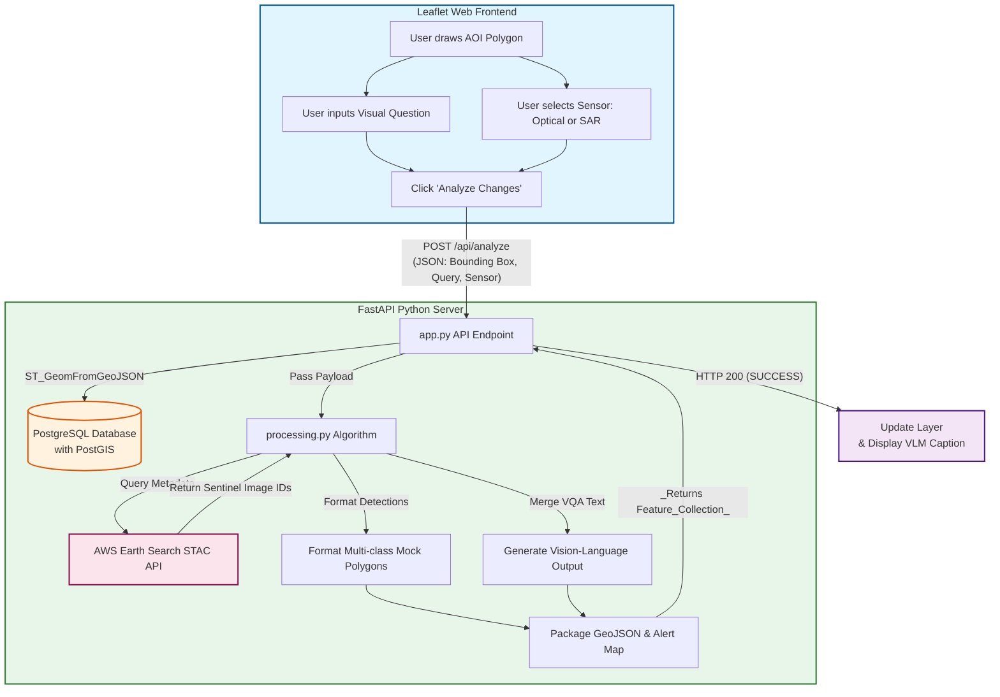

# Satellite Vision Pipeline MVP 🛰️

A cloud-native, full-stack geospatial pipeline built to demonstrate end-to-end satellite image processing architectures. It highlights the infrastructure needed for **Vision-Language Models (VLMs)**, **Multi-Sensor Data Fusion (SAR/Optical)**, and **Change Detection**.

This project was specifically architected as a Proof of Concept (PoC) for Earth Observation machine learning pipelines, natively connecting front-end user interfaces to AWS-hosted planetary data.

## 🚀 Key Features

*   **Dynamic STAC API Integration**: Directly interfaces with AWS Earth Search (Element84) to query real-time Sentinel-1 (SAR) and Sentinel-2 (Optical) metadata via native REST clients.
*   **Vision-Language Model (VQA) Interface**: Includes a frontend Visual Question Answering (VQA) input that merges user text queries with live satellite metadata to generate contextual captions.
*   **Multi-Class Semantic Segmentation**: Architected to ingest and display multi-class geospatial polygons (e.g., Object Detection for New Structures vs. Semantic Segmentation for Vegetation Clearance).
*   **Spatial Database Storage**: Utilizes PostgreSQL + PostGIS to natively store and query `GeoJSON` bounding boxes.

## 📊 Architecture Flowchart



## 💻 Tech Stack
*   **Frontend**: HTML5, Vanilla JS, OpenLayers
*   **Backend**: Python 3.10+, FastAPI, Uvicorn 
*   **Database**: PostgreSQL, PostGIS, `asyncpg`
*   **Geospatial Processing**: Built-in REST STAC integration, GeoJSON parsing

## 🛠️ How to Run Locally

### 1. Database Setup
Make sure you have PostgreSQL running locally with the **PostGIS** extension installed. Create an empty database named `satellite_db`.
   
### 2. Initialize the Tables
```bash
conda activate satellite_mvp
cd backend
python init_db.py
```

### 3. Start the API Server
```bash
uvicorn app:app --reload
```
The server will now accept API connections on `http://127.0.0.1:8000`.

### 4. Launch the Web App
Open your web browser and navigate directly to:
```
http://127.0.0.1:8000/
```
*(FastAPI natively serves the frontend HTML, automatically zooming to Bhubaneswar).*
